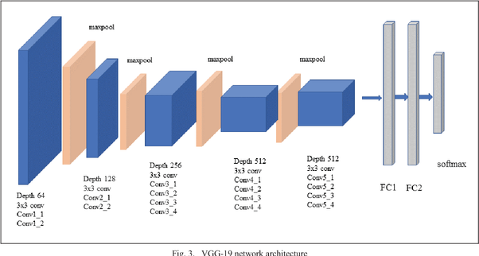
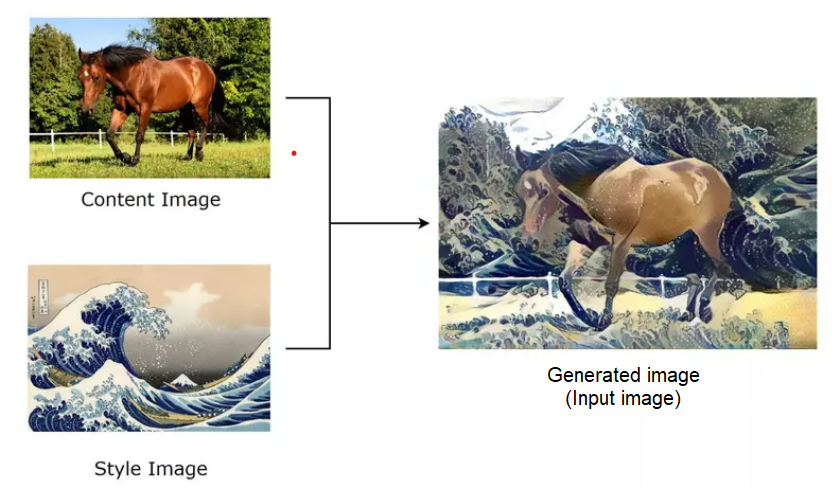
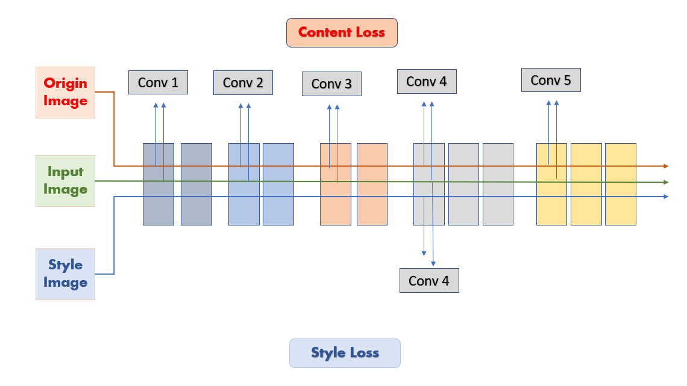

# Style Transfer App

## Introduction
A small application used to perform **style transfer**. Style transfer is a computer vision technique that allows us to recompose the content of an image in the style of another. If you’ve ever imagined what a photo might look like if it were painted by a famous artist, then style transfer is the computer vision technique that turns this into a reality.

### Built With
* [![Python][Python_img]][Python-url]
* [![Streamlit][Streamlit_img]][Streamlit-url]
* [![PyTorch][torch-img]][torch-url]

## Technical overview
* **Streamlit** is an open source Python framework for building easy-to-use interactive web applications for data visualization and machine learning model implementation. It provides a fast way to build user interfaces for Python-based applications and allows users to interact with machine learning model components directly.

* **PyTorch** is an open source Python library for building machine learning models. It is widely used in deep learning and provides a flexible way to define, train, and deploy models. PyTorch provides a powerful organizational approach to building neural networks and integrates quickly with other libraries in the Python ecosystem.

* **The VGG-19 model** is a deep convolutional neural network model in the field of computer vision. The organized VGG-19 model consists of 19 network layers, including convolutional layers and nonlinear layers. This model is trained on a large data set like ImageNet and has the ability to recognize and classify images with high performance.

Using Streamlit and PyTorch, we can build an interactive web application that implements the VGG-19 model. In it, Streamlit provides user interface elements such as buttons, sliders, and charts to create a convenient interactive experience for users.

## How to install
### Github

**Installation Dependencies:** required libraries are located in requirements.txt
* pandas 
* numpy
* streamlit
* opencv-python
* torch
* torchvision
* matplotlib

**Install Project:**

```
git clone https://github.com/nhduong1203/TransferApp.git
cd TransferApp
pip install requirements.txt
streamlit run main.py
```
### Docker
**Link Docker:** [Docker Repo][docker-url]

**Install Project:**
```
# Pull docker
docker pull sieucun/transfer_app

# Run image
docker run --name test -p 8501:8501 transfer_app

Access the application at: http://localhost:8501
```
## Experiments
### Link
* [Application][app-url]
* [Docker][docker-url]

### Deep Learning Model VGG-19
The deep learning model used in this project is named VGG-19, its architecture is shown in the following image: 


Some of the terms used are as follows:
* Content image: the original image
* Style image: image that we want to apply its style to the original image
* Generated image (or Input image): image obtained through style transformation


### Training
We will create a copy of the original image as an input image, and to create a combination of the original image and the style image, we will make the input image the same as both the original image and the style image as possible. To do so, our model will not only perform gradient updates on the weights and bias, but also directly on the input image. One of the most important is to design the appropriate loss function for this backpropagation. The loss function in the current model is design as follows:


The loss function will not only be calculated on the output of the model, but also throughout the model after each convolution layer. In there:

* **Content loss:** measure the difference between the original image and the generated image. The content loss after each convolution is calculated using the ```mse_loss()``` function and the final content loss is calculated as their sum.
* **Style loss:** measure the difference between the style image and the generated image. For the purpose of learning styles from style images, a commonly used method is the use of a **_Gram matrix_**. The Gram matrix represents the spatial correlation between features in an image by calculating the dot product between them. By comparing the Gram matrix of the style image and the input image, we can measure the degree of stylistic similarity. Optimizing the input image to have Gram matrix similar to the Gram matrix of the style image helps to reproduce that style on the input image. 
```
def gram_matrix(input):
    a, b, c, d = input.size()  
    features = input.view(a * b, c * d) 
    G = torch.mm(features, features.t()) 
    return G.div(a * b * c * d)
```

The final loss function is synthesized from content loss and style loss
```
final_loss = content_weight * content_loss + style_weight * style_loss
```

From this loss function, we perform backpropagation through the weights and directly through the input image.

## References
[1] [Neural Style Transfer][exp1] \
[2] [Streamlit tutorial][exp2] \
[3] [Deploy Streamlit using Docker][exp3] \
[4] [Very Deep Convolutional Networks for Large-Scale Image Recognition][exp4]

[Python_img]: https://img.shields.io/badge/python-3670A0?style=for-the-badge&logo=python&logoColor=ffdd54
[Python-url]: python.org

[Streamlit_img]: https://user-images.githubusercontent.com/7164864/217935870-c0bc60a3-6fc0-4047-b011-7b4c59488c91.png
[Streamlit-url]: streamlit.io

[torch-img]: https://img.shields.io/badge/PyTorch-%23EE4C2C.svg?style=for-the-badge&logo=PyTorch&logoColor=white
[torch-url]: https://pytorch.org/

[docker-url]: https://hub.docker.com/repository/docker/sieucun/transfer_app/general
[app-url]: https://nhduong1203-demoapp-main-3dx8ye.streamlit.app/?fbclid=IwAR1GSzh-a1ZKXywWH9rsd4s4yQOsxT-Wnbqh8rFM_fDmnpxTyrW2xYcii6Q
[exp1]: https://pytorch.org/tutorials/advanced/neural_style_tutorial.html
[exp2]: https://docs.streamlit.io/knowledge-base/tutorials
[exp3]: https://docs.streamlit.io/knowledge-base/tutorials/deploy/docker
[exp4]: https://arxiv.org/abs/1409.1556

